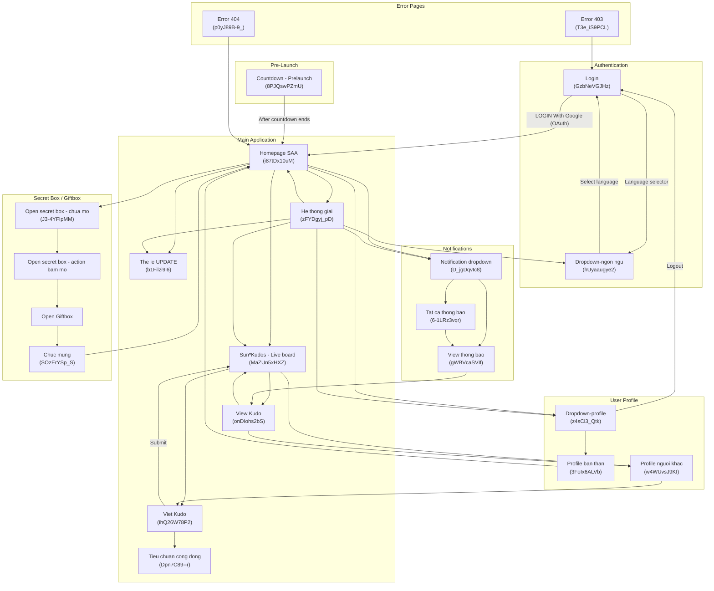
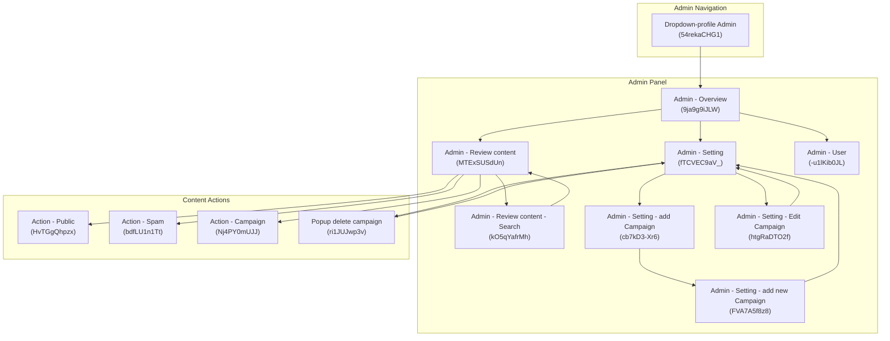
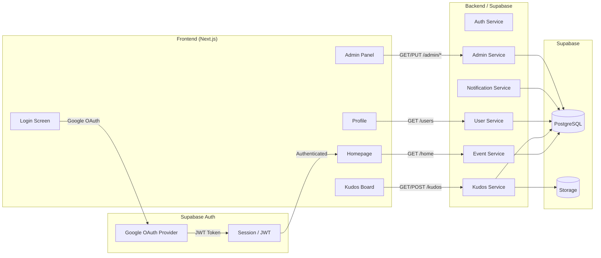

# Screen Flow Overview

## Project Info
- **Project Name**: Sun Annual Awards 2025 (SAA 2025)
- **Figma File Key**: 9ypp4enmFmdK3YAFJLIu6C
- **Figma URL**: https://www.figma.com/design/9ypp4enmFmdK3YAFJLIu6C
- **Created**: 2026-04-15
- **Last Updated**: 2026-04-17

---

## Discovery Progress

| Metric | Count |
|--------|-------|
| Total Screens | 114 |
| Discovered | 114 |
| App Screens (Web) | 42 |
| Components/UI | 72 |
| Completion | 100% |

---

## Screens

### Web Application Screens

| # | Screen Name | Frame ID | Figma Link | Status | Predicted APIs | Navigations To |
|---|-------------|----------|------------|--------|----------------|----------------|
| 1 | Login | GzbNeVGJHz | [Link](https://www.figma.com/design/9ypp4enmFmdK3YAFJLIu6C?node-id=GzbNeVGJHz) | discovered | POST /auth/google | Homepage SAA, Dropdown-ngon ngu |
| 2 | Countdown - Prelaunch page | 8PJQswPZmU | [Link](https://www.figma.com/design/9ypp4enmFmdK3YAFJLIu6C?node-id=8PJQswPZmU) | discovered | GET /event/status | Homepage SAA (after countdown) |
| 3 | Homepage SAA | i87tDx10uM | [Link](https://www.figma.com/design/9ypp4enmFmdK3YAFJLIu6C?node-id=i87tDx10uM) | discovered | GET /home, GET /awards, GET /kudos/recent | He thong giai, Sun*Kudos Live board, Profile, Notifications, The le, Open secret box, Viet Kudo |
| 4 | He thong giai (Award System) | zFYDgyj_pD | [Link](https://www.figma.com/design/9ypp4enmFmdK3YAFJLIu6C?node-id=zFYDgyj_pD) | discovered (spec'd) | GET /awards, GET /awards/:id, GET /users/me, GET /notifications | Homepage SAA, Sun*Kudos Live board, The le, Dropdown-ngon ngu, Notification dropdown, Dropdown-profile |
| 5 | Sun* Kudos - Live board | MaZUn5xHXZ | [Link](https://www.figma.com/design/9ypp4enmFmdK3YAFJLIu6C?node-id=MaZUn5xHXZ) | discovered | GET /kudos, GET /kudos/filter | Viet Kudo, View Kudo, Profile nguoi khac, Dropdown Hashtag filter, Dropdown Phong ban |
| 6 | D1_Sunkudos | QJd9jB9PDt | [Link](https://www.figma.com/design/9ypp4enmFmdK3YAFJLIu6C?node-id=QJd9jB9PDt) | discovered | GET /kudos | Sun*Kudos Live board |
| 7 | Viet Kudo (Write Kudo) | ihQ26W78P2 | [Link](https://www.figma.com/design/9ypp4enmFmdK3YAFJLIu6C?node-id=ihQ26W78P2) | discovered | POST /kudos, GET /users/search | Sun*Kudos Live board, Dropdown list hashtag, Dropdown list nguoi nhan |
| 8 | Viet KUDO - Loi chua dien du | 5c7PkAibyD | [Link](https://www.figma.com/design/9ypp4enmFmdK3YAFJLIu6C?node-id=5c7PkAibyD) | discovered | - | Viet Kudo |
| 9 | View Kudo | onDIohs2bS | [Link](https://www.figma.com/design/9ypp4enmFmdK3YAFJLIu6C?node-id=onDIohs2bS) | discovered | GET /kudos/:id | Sun*Kudos Live board, Profile nguoi khac |
| 10 | Gui loi chuc Kudos (Send Kudo - variant 1) | JsTvi8KVQA | [Link](https://www.figma.com/design/9ypp4enmFmdK3YAFJLIu6C?node-id=JsTvi8KVQA) | discovered | POST /kudos | Sun*Kudos Live board |
| 11 | Gui loi chuc Kudos (Send Kudo - variant 2) | RO7O6QOhfJ | [Link](https://www.figma.com/design/9ypp4enmFmdK3YAFJLIu6C?node-id=RO7O6QOhfJ) | discovered | POST /kudos | Sun*Kudos Live board |
| 12 | Man Sua bai viet - edit mode | 419VXmMy6I | [Link](https://www.figma.com/design/9ypp4enmFmdK3YAFJLIu6C?node-id=419VXmMy6I) | discovered | PUT /kudos/:id | Sun*Kudos Live board |
| 13 | Profile ban than (Own Profile) | 3FoIx6ALVb | [Link](https://www.figma.com/design/9ypp4enmFmdK3YAFJLIu6C?node-id=3FoIx6ALVb) | discovered | GET /users/me, GET /users/me/kudos | Homepage SAA, Dropdown-profile |
| 14 | Profile nguoi khac (Other's Profile) | w4WUvsJ9KI | [Link](https://www.figma.com/design/9ypp4enmFmdK3YAFJLIu6C?node-id=w4WUvsJ9KI) | discovered | GET /users/:id, GET /users/:id/kudos | Gui loi chuc Kudos, Sun*Kudos Live board |
| 15 | Tat ca thong bao (All Notifications) | 6-1LRz3vqr | [Link](https://www.figma.com/design/9ypp4enmFmdK3YAFJLIu6C?node-id=6-1LRz3vqr) | discovered | GET /notifications | View thong bao, Homepage SAA |
| 16 | View thong bao (View Notification) | gWBVcaSVIf | [Link](https://www.figma.com/design/9ypp4enmFmdK3YAFJLIu6C?node-id=gWBVcaSVIf) | discovered | GET /notifications/:id | View Kudo, Homepage SAA |
| 17 | The le UPDATE (Rules) | b1Filzi9i6 | [Link](https://www.figma.com/design/9ypp4enmFmdK3YAFJLIu6C?node-id=b1Filzi9i6) | discovered | GET /rules | Homepage SAA |
| 18 | The le - DONE (Rules variant 1) | 4TMyWyKO1U | [Link](https://www.figma.com/design/9ypp4enmFmdK3YAFJLIu6C?node-id=4TMyWyKO1U) | discovered | GET /rules | Homepage SAA |
| 19 | The le - DONE (Rules variant 2) | tajvZVN9v7 | [Link](https://www.figma.com/design/9ypp4enmFmdK3YAFJLIu6C?node-id=tajvZVN9v7) | discovered | GET /rules | Homepage SAA |
| 20 | The le - DONE (Rules variant 3) | EWoWPJkDtV | [Link](https://www.figma.com/design/9ypp4enmFmdK3YAFJLIu6C?node-id=EWoWPJkDtV) | discovered | GET /rules | Homepage SAA |
| 21 | Tieu chuan cong dong (Community Standards) | Dpn7C89--r | [Link](https://www.figma.com/design/9ypp4enmFmdK3YAFJLIu6C?node-id=Dpn7C89--r) | discovered | GET /community-standards | Viet Kudo |
| 22 | Open secret box - chua mo | J3-4YFIpMM | [Link](https://www.figma.com/design/9ypp4enmFmdK3YAFJLIu6C?node-id=J3-4YFIpMM) | discovered | GET /secret-box/status | Open secret box - action bam mo |
| 23 | Open secret box - chua mo (variant) | m0zV-VstXX | [Link](https://www.figma.com/design/9ypp4enmFmdK3YAFJLIu6C?node-id=m0zV-VstXX) | discovered | GET /secret-box/status | Open secret box - action bam mo |
| 24 | Open secret box - action bam mo (variant 1) | K-LuEblC08 | [Link](https://www.figma.com/design/9ypp4enmFmdK3YAFJLIu6C?node-id=K-LuEblC08) | discovered | POST /secret-box/open | Open secret box - standby |
| 25 | Open secret box - action bam mo (variant 2) | p0qHd6DJ6A | [Link](https://www.figma.com/design/9ypp4enmFmdK3YAFJLIu6C?node-id=p0qHd6DJ6A) | discovered | POST /secret-box/open | Open secret box - standby |
| 26 | Open Giftbox (variant 1) | _YLVd7Ij6e | [Link](https://www.figma.com/design/9ypp4enmFmdK3YAFJLIu6C?node-id=_YLVd7Ij6e) | discovered | POST /giftbox/open | Homepage SAA |
| 27 | Open Giftbox (variant 2) | A3J33jY-Wp | [Link](https://www.figma.com/design/9ypp4enmFmdK3YAFJLIu6C?node-id=A3J33jY-Wp) | discovered | POST /giftbox/open | Homepage SAA |
| 28 | Open Giftbox (variant 3) | hCRbDKyaoT | [Link](https://www.figma.com/design/9ypp4enmFmdK3YAFJLIu6C?node-id=hCRbDKyaoT) | discovered | POST /giftbox/open | Homepage SAA |
| 29 | Chuc mung (Congratulations) | SOzErYSp_S | [Link](https://www.figma.com/design/9ypp4enmFmdK3YAFJLIu6C?node-id=SOzErYSp_S) | discovered | - | Homepage SAA |
| 30 | An danh (Anonymous) | p9vFVBE_tc | [Link](https://www.figma.com/design/9ypp4enmFmdK3YAFJLIu6C?node-id=p9vFVBE_tc) | discovered | - | Viet Kudo |
| 31 | Floating Action Button | _hphd32jN2 | [Link](https://www.figma.com/design/9ypp4enmFmdK3YAFJLIu6C?node-id=_hphd32jN2) | discovered | - | Viet Kudo, Homepage SAA |
| 32 | Floating Action Button 2 | Sv7DFwBw1h | [Link](https://www.figma.com/design/9ypp4enmFmdK3YAFJLIu6C?node-id=Sv7DFwBw1h) | discovered | - | Viet Kudo, Homepage SAA |
| 33 | Error page - 403 | T3e_iS9PCL | [Link](https://www.figma.com/design/9ypp4enmFmdK3YAFJLIu6C?node-id=T3e_iS9PCL) | discovered | - | Login, Homepage SAA |
| 34 | Error page - 404 | p0yJ89B-9_ | [Link](https://www.figma.com/design/9ypp4enmFmdK3YAFJLIu6C?node-id=p0yJ89B-9_) | discovered | - | Homepage SAA |
| 35 | Alert Overlay | ZUofoTelpc | [Link](https://www.figma.com/design/9ypp4enmFmdK3YAFJLIu6C?node-id=ZUofoTelpc) | discovered | - | (contextual) |

### Web Application - Dropdown/Overlay Components

| # | Screen Name | Frame ID | Figma Link | Status | Navigations To |
|---|-------------|----------|------------|--------|----------------|
| 1 | Dropdown-ngon ngu (Language) | hUyaaugye2 | [Link](https://www.figma.com/design/9ypp4enmFmdK3YAFJLIu6C?node-id=hUyaaugye2) | discovered | (closes overlay, reloads current page) |
| 2 | Dropdown-profile | z4sCl3_Qtk | [Link](https://www.figma.com/design/9ypp4enmFmdK3YAFJLIu6C?node-id=z4sCl3_Qtk) | discovered | Profile ban than, Login (logout) |
| 3 | Dropdown-profile Admin | 54rekaCHG1 | [Link](https://www.figma.com/design/9ypp4enmFmdK3YAFJLIu6C?node-id=54rekaCHG1) | discovered | Profile ban than, Admin - Overview, Login (logout) |
| 4 | Dropdown Hashtag filter | JWpsISMAaM | [Link](https://www.figma.com/design/9ypp4enmFmdK3YAFJLIu6C?node-id=JWpsISMAaM) | discovered | (filters Sun*Kudos Live board) |
| 5 | Dropdown Phong ban (Department) | WXK5AYB_rG | [Link](https://www.figma.com/design/9ypp4enmFmdK3YAFJLIu6C?node-id=WXK5AYB_rG) | discovered | (filters Sun*Kudos Live board) |
| 6 | Dropdown list hashtag | p9zO-c4a4x | [Link](https://www.figma.com/design/9ypp4enmFmdK3YAFJLIu6C?node-id=p9zO-c4a4x) | discovered | (populates Viet Kudo form) |
| 7 | Dropdown list nguoi nhan (Recipient) | zJzaC9GgXt | [Link](https://www.figma.com/design/9ypp4enmFmdK3YAFJLIu6C?node-id=zJzaC9GgXt) | discovered | (populates Viet Kudo form) |
| 8 | Dropdown list nguoi nhan muon gui loi chuc | QIMJNgFb8K | [Link](https://www.figma.com/design/9ypp4enmFmdK3YAFJLIu6C?node-id=QIMJNgFb8K) | discovered | (populates send kudos form) |
| 9 | Dropdown list nguoi da gui (Sender) | neIUcD-nc- | [Link](https://www.figma.com/design/9ypp4enmFmdK3YAFJLIu6C?node-id=neIUcD-nc-) | discovered | (filters list) |
| 10 | Dropdown-filter da nhan/gui | rQqxNoXoii | [Link](https://www.figma.com/design/9ypp4enmFmdK3YAFJLIu6C?node-id=rQqxNoXoii) | discovered | (filters list) |
| 11 | Dropdown chon thoi gian (Time picker) | lJj0-WlUn5 | [Link](https://www.figma.com/design/9ypp4enmFmdK3YAFJLIu6C?node-id=lJj0-WlUn5) | discovered | (filters list) |
| 12 | Dropdown-List | MWNZNCBr8_ | [Link](https://www.figma.com/design/9ypp4enmFmdK3YAFJLIu6C?node-id=MWNZNCBr8_) | discovered | (generic dropdown) |
| 13 | Dropdown list phong ban | eFStQCJZaQ | [Link](https://www.figma.com/design/9ypp4enmFmdK3YAFJLIu6C?node-id=eFStQCJZaQ) | discovered | (admin filter) |
| 14 | Dropdown list status | UBeTfWM-AP | [Link](https://www.figma.com/design/9ypp4enmFmdK3YAFJLIu6C?node-id=UBeTfWM-AP) | discovered | (admin filter) |
| 15 | Dropdown level | hb4kPwSKkk | [Link](https://www.figma.com/design/9ypp4enmFmdK3YAFJLIu6C?node-id=hb4kPwSKkk) | discovered | (admin filter) |
| 16 | Dropdown Role | GLgos3fOmz | [Link](https://www.figma.com/design/9ypp4enmFmdK3YAFJLIu6C?node-id=GLgos3fOmz) | discovered | (admin filter) |
| 17 | Dropdown search user admin | BFf3J-wRPk | [Link](https://www.figma.com/design/9ypp4enmFmdK3YAFJLIu6C?node-id=BFf3J-wRPk) | discovered | (admin user search) |
| 18 | Hover Avatar info user | Bf5XiTE7AO | [Link](https://www.figma.com/design/9ypp4enmFmdK3YAFJLIu6C?node-id=Bf5XiTE7AO) | discovered | Profile nguoi khac |
| 19 | Hover campain | gI07KYVJWE | [Link](https://www.figma.com/design/9ypp4enmFmdK3YAFJLIu6C?node-id=gI07KYVJWE) | discovered | (info tooltip) |
| 20 | Hover danh hieu Legend Hero | XI0QKVv1qZ | [Link](https://www.figma.com/design/9ypp4enmFmdK3YAFJLIu6C?node-id=XI0QKVv1qZ) | discovered | (info tooltip) |
| 21 | Hover danh hieu New Hero | twC9br89ra | [Link](https://www.figma.com/design/9ypp4enmFmdK3YAFJLIu6C?node-id=twC9br89ra) | discovered | (info tooltip) |
| 22 | Hover danh hieu Rising Hero | IjeDnHmzou | [Link](https://www.figma.com/design/9ypp4enmFmdK3YAFJLIu6C?node-id=IjeDnHmzou) | discovered | (info tooltip) |
| 23 | Hover danh hieu Super Hero | d6zEZ9ccoX | [Link](https://www.figma.com/design/9ypp4enmFmdK3YAFJLIu6C?node-id=d6zEZ9ccoX) | discovered | (info tooltip) |
| 24 | Addlink Box | OyDLDuSGEa | [Link](https://www.figma.com/design/9ypp4enmFmdK3YAFJLIu6C?node-id=OyDLDuSGEa) | discovered | (modal overlay) |
| 25 | Popup delete campaign | ri1JUJwp3v | [Link](https://www.figma.com/design/9ypp4enmFmdK3YAFJLIu6C?node-id=ri1JUJwp3v) | discovered | Admin - Setting |
| 26 | Notification (dropdown) | D_jgDqvIc8 | [Link](https://www.figma.com/design/9ypp4enmFmdK3YAFJLIu6C?node-id=D_jgDqvIc8) | discovered | Tat ca thong bao, View thong bao |

### Web Application - Admin Panel

| # | Screen Name | Frame ID | Figma Link | Status | Predicted APIs | Navigations To |
|---|-------------|----------|------------|--------|----------------|----------------|
| 1 | Admin - Overview | 9ja9g9iJLW | [Link](https://www.figma.com/design/9ypp4enmFmdK3YAFJLIu6C?node-id=9ja9g9iJLW) | discovered | GET /admin/overview, GET /admin/stats | Admin - Review content, Admin - Setting, Admin - User |
| 2 | Admin - Review content | MTExSUSdUn | [Link](https://www.figma.com/design/9ypp4enmFmdK3YAFJLIu6C?node-id=MTExSUSdUn) | discovered | GET /admin/kudos, PUT /admin/kudos/:id/status | Admin - Review content - Search, Action - Public, Action - Spam |
| 3 | Admin - Review content - Search | kO5qYafrMh | [Link](https://www.figma.com/design/9ypp4enmFmdK3YAFJLIu6C?node-id=kO5qYafrMh) | discovered | GET /admin/kudos/search | Admin - Review content |
| 4 | Admin - Setting | fTCVEC9aV_ | [Link](https://www.figma.com/design/9ypp4enmFmdK3YAFJLIu6C?node-id=fTCVEC9aV_) | discovered | GET /admin/campaigns | Admin - Setting - add Campaign, Admin - Setting - Edit Campaign |
| 5 | Admin - Setting - add Campaign | cb7kD3-Xr6 | [Link](https://www.figma.com/design/9ypp4enmFmdK3YAFJLIu6C?node-id=cb7kD3-Xr6) | discovered | - | Admin - Setting - add new Campaign |
| 6 | Admin - Setting - add new Campaign | FVA7A5f8z8 | [Link](https://www.figma.com/design/9ypp4enmFmdK3YAFJLIu6C?node-id=FVA7A5f8z8) | discovered | POST /admin/campaigns | Admin - Setting |
| 7 | Admin - Setting - Edit Campaign | htgRaDTO2f | [Link](https://www.figma.com/design/9ypp4enmFmdK3YAFJLIu6C?node-id=htgRaDTO2f) | discovered | PUT /admin/campaigns/:id | Admin - Setting |
| 8 | Admin - User | -u1lKib0JL | [Link](https://www.figma.com/design/9ypp4enmFmdK3YAFJLIu6C?node-id=-u1lKib0JL) | discovered | GET /admin/users, PUT /admin/users/:id/role | Dropdown search user admin, Dropdown Role |
| 9 | Action - Campaign | Nj4PY0mUJJ | [Link](https://www.figma.com/design/9ypp4enmFmdK3YAFJLIu6C?node-id=Nj4PY0mUJJ) | discovered | - | Admin - Review content |
| 10 | Action - Public | HvTGgQhpzx | [Link](https://www.figma.com/design/9ypp4enmFmdK3YAFJLIu6C?node-id=HvTGgQhpzx) | discovered | PUT /admin/kudos/:id/publish | Admin - Review content |
| 11 | Action - Spam | bdfLU1n1Tt | [Link](https://www.figma.com/design/9ypp4enmFmdK3YAFJLIu6C?node-id=bdfLU1n1Tt) | discovered | PUT /admin/kudos/:id/spam | Admin - Review content |

---

## Navigation Graph

### Web Application - Main Flow

### Web Application - Admin Flow

---

## Screen Groups

### Group: Authentication
| Screen | Purpose | Entry Points |
|--------|---------|--------------|
| Login (GzbNeVGJHz) | Google OAuth user authentication | App launch, Logout, Session expired, Error 403 |
| Dropdown-ngon ngu (hUyaaugye2) | Language selection overlay (VI/EN/JP) | Login header, Homepage header |
| Dropdown-profile (z4sCl3_Qtk) | User profile menu with logout | Header avatar click |
| Dropdown-profile Admin (54rekaCHG1) | Admin profile menu with admin panel link | Header avatar click (admin users) |

### Group: Pre-Launch
| Screen | Purpose | Entry Points |
|--------|---------|--------------|
| Countdown - Prelaunch page (8PJQswPZmU) | Event countdown before SAA 2025 goes live | Direct URL before event launch |

### Group: Main Application
| Screen | Purpose | Entry Points |
|--------|---------|--------------|
| Homepage SAA (i87tDx10uM) | Main hub / dashboard after login | After login, back navigation |
| He thong giai (zFYDgyj_pD) | Award categories and nomination system | Homepage navigation |
| Sun*Kudos - Live board (MaZUn5xHXZ) | Live feed of kudos messages | Homepage navigation, after submitting kudo |
| The le UPDATE (b1Filzi9i6) | Event rules and regulations | Homepage navigation |

### Group: Kudos
| Screen | Purpose | Entry Points |
|--------|---------|--------------|
| Viet Kudo (ihQ26W78P2) | Write and submit a new kudo | Kudos board, Floating Action Button, Profile |
| View Kudo (onDIohs2bS) | View a single kudo detail | Kudos board, Notifications |
| Gui loi chuc Kudos (JsTvi8KVQA) | Send kudos greeting | Profile nguoi khac, Kudos board |
| Man Sua bai viet (419VXmMy6I) | Edit existing kudo post | View Kudo (own post) |
| Tieu chuan cong dong (Dpn7C89--r) | Community standards / guidelines | Viet Kudo screen |
| An danh (p9vFVBE_tc) | Anonymous kudo posting mode | Viet Kudo toggle |

### Group: User Profile
| Screen | Purpose | Entry Points |
|--------|---------|--------------|
| Profile ban than (3FoIx6ALVb) | Own user profile with stats and kudos | Profile dropdown |
| Profile nguoi khac (w4WUvsJ9KI) | Other user's profile | Kudos board, View Kudo, Search, Hover avatar |

### Group: Notifications
| Screen | Purpose | Entry Points |
|--------|---------|--------------|
| Notification dropdown (D_jgDqvIc8) | Quick notification list in header | Bell icon in header |
| Tat ca thong bao (6-1LRz3vqr) | All notifications page | Notification dropdown "View all" |
| View thong bao (gWBVcaSVIf) | Single notification detail | Notification list item click |

### Group: Secret Box / Giftbox
| Screen | Purpose | Entry Points |
|--------|---------|--------------|
| Open secret box - chua mo (J3-4YFIpMM) | Unopened secret box state | Homepage |
| Open secret box - action bam mo | Box opening animation/action | Secret box click |
| Open Giftbox | Giftbox reveal states | After secret box opened |
| Chuc mung (SOzErYSp_S) | Congratulations after opening | After giftbox reveal |

### Group: Admin Panel
| Screen | Purpose | Entry Points |
|--------|---------|--------------|
| Admin - Overview (9ja9g9iJLW) | Admin dashboard with statistics | Admin profile dropdown |
| Admin - Review content (MTExSUSdUn) | Review and moderate kudo posts | Admin sidebar navigation |
| Admin - Review content - Search (kO5qYafrMh) | Search within review content | Review content search bar |
| Admin - Setting (fTCVEC9aV_) | Campaign and system settings | Admin sidebar navigation |
| Admin - Setting - add Campaign (cb7kD3-Xr6) | Add campaign form (initial) | Admin Setting page |
| Admin - Setting - add new Campaign (FVA7A5f8z8) | Add new campaign form (filled) | Add Campaign page |
| Admin - Setting - Edit Campaign (htgRaDTO2f) | Edit existing campaign | Admin Setting page |
| Admin - User (-u1lKib0JL) | User management and role assignment | Admin sidebar navigation |

### Group: Error Pages
| Screen | Purpose | Entry Points |
|--------|---------|--------------|
| Error page - 403 (T3e_iS9PCL) | Access denied / Forbidden | Unauthorized access attempt |
| Error page - 404 (p0yJ89B-9_) | Page not found | Invalid URL |

---

## API Endpoints Summary

| Endpoint | Method | Screens Using | Purpose |
|----------|--------|---------------|---------|
| /auth/google | POST | Login | Google OAuth authentication |
| /auth/logout | POST | Dropdown-profile, Dropdown-profile Admin | User logout |
| /event/status | GET | Countdown - Prelaunch | Check if event is live |
| /home | GET | Homepage SAA | Homepage data (awards, stats, featured) |
| /awards | GET | He thong giai, Homepage SAA | List award categories |
| /awards/:id | GET | He thong giai | Award category detail |
| /kudos | GET | Sun*Kudos Live board | List kudos feed |
| /kudos | POST | Viet Kudo, Gui loi chuc Kudos | Create new kudo |
| /kudos/:id | GET | View Kudo | Get single kudo detail |
| /kudos/:id | PUT | Man Sua bai viet | Update existing kudo |
| /kudos/filter | GET | Sun*Kudos Live board | Filter kudos by hashtag/department |
| /users/me | GET | Profile ban than | Get current user profile |
| /users/me/kudos | GET | Profile ban than | Get current user's kudos |
| /users/:id | GET | Profile nguoi khac | Get other user's profile |
| /users/:id/kudos | GET | Profile nguoi khac | Get other user's kudos |
| /users/search | GET | Viet Kudo, Dropdown list nguoi nhan | Search users for kudo recipient |
| /notifications | GET | Tat ca thong bao, Notification dropdown | List notifications |
| /notifications/:id | GET | View thong bao | Get notification detail |
| /secret-box/status | GET | Open secret box - chua mo | Check secret box status |
| /secret-box/open | POST | Open secret box - action bam mo | Open secret box |
| /giftbox/open | POST | Open Giftbox | Open giftbox reward |
| /rules | GET | The le | Get event rules |
| /community-standards | GET | Tieu chuan cong dong | Get community standards |
| /hashtags | GET | Dropdown Hashtag filter, Dropdown list hashtag | List available hashtags |
| /departments | GET | Dropdown Phong ban, Dropdown list phong ban | List departments |
| /admin/overview | GET | Admin - Overview | Admin dashboard stats |
| /admin/stats | GET | Admin - Overview | Admin detailed statistics |
| /admin/kudos | GET | Admin - Review content | List kudos for review |
| /admin/kudos/search | GET | Admin - Review content - Search | Search kudos in admin |
| /admin/kudos/:id/status | PUT | Admin - Review content | Update kudo status |
| /admin/kudos/:id/publish | PUT | Action - Public | Publish a kudo |
| /admin/kudos/:id/spam | PUT | Action - Spam | Mark kudo as spam |
| /admin/campaigns | GET | Admin - Setting | List campaigns |
| /admin/campaigns | POST | Admin - Setting - add new Campaign | Create new campaign |
| /admin/campaigns/:id | PUT | Admin - Setting - Edit Campaign | Update campaign |
| /admin/campaigns/:id | DELETE | Popup delete campaign | Delete campaign |
| /admin/users | GET | Admin - User | List users for management |
| /admin/users/:id/role | PUT | Admin - User | Update user role |

---

## Data Flow

---

## Technical Notes

### Authentication Flow
- Google OAuth via Supabase Auth
- JWT-based session management
- Token stored in Supabase client-side session (cookie-based)
- Admin role requires special role assignment via Admin - User panel

### State Management
- Server state: Supabase client SDK with real-time subscriptions
- Global state: React Context / Zustand (TBD)
- i18n: Multi-language support (Vietnamese, English, Japanese) via language dropdown

### Routing
- Router: Next.js App Router
- Protected routes require Supabase authentication session
- Admin routes require admin role check
- Pre-launch route shows countdown before event goes live

### Platform Support
- **Web**: Full-featured responsive web application (responsive design for mobile/tablet/desktop)

---

## Discovery Log

| Date | Action | Screens | Notes |
|------|--------|---------|-------|
| 2026-04-15 | Full discovery | 152 frames total | Initial comprehensive scan of all Figma frames |
| 2026-04-15 | Categorization | 42 web app + 72 components | Separated screens from UI component frames |
| 2026-04-16 | Scoped to Web only | 114 frames (42 web + 72 components) | Removed iOS screens per project scope |
| 2026-04-15 | Navigation mapping | All screen groups | Mapped Login -> Homepage -> all feature flows |
| 2026-04-15 | API endpoint prediction | 35 endpoints | Predicted REST API endpoints from screen interactions |
| 2026-04-17 | Screen spec created | He thong giai (zFYDgyj_pD) | Detailed screen spec generated at `.momorph/contexts/screen_specs/he-thong-giai.md`; mapped header/footer navigations, 6 award cards, Sun*Kudos promo CTA, anchor-scroll left menu |

---

## Next Steps

- [ ] Verify navigation paths with design team
- [ ] Confirm API endpoint naming conventions with backend team

- [ ] Map real-time subscription endpoints for Kudos live board
- [ ] Confirm admin role-based access control flow
- [ ] Review secret box / giftbox gamification flow details
- [ ] Validate i18n language switching behavior across all screens
